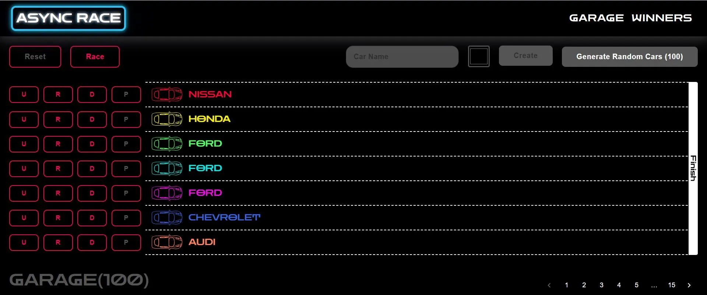

# Async-race

**Score:** 385 / 400 points  
**Live Demo:** [https://async-race-silk.vercel.app/](https://async-race-silk.vercel.app/)



## About the App

- Async Race is a Single Page Application (SPA) designed to:
    - Manage a collection of cars (create, edit, delete).
    - Operate car engines and run races.
    - Track race statistics, including winners, best times, and wins.
    - Provide interactive and responsive animations for any device.

## Implemented Features:

- Basic Structure (80 points)
    - Two Views (10 points)
    - Garage View Content (30 points)
    - Winners View Content (10 points)
- Garage View (90 points)
    - Car Creation And Editing Panel. CRUD Operations (20 points)
    - Color Selection (10 points)
    - Random Car Creation (20 points)
    - Car Management Buttons (10 points)
    - Pagination (10 points)
    - Persistent State (15 / 30 points)(page numbers - preservation)
    - EXTRA POINTS (20 points)(Empty Garage/Empty Garage Page)
- Winners View (50 points)
    - Display Winners (15 points)
    - Pagination for Winners (10 points)
    - Winners Table (15 points)
    - Sorting Functionality (10 points)
- Race (170 points)
    - Start Engine Animation (20 points)
    - Stop Engine Animation (20 points)
    - Responsive Animation (30 points)
    - Start Race Button (10 points)
    - Reset Race Button (15 points)
    - Winner Announcement (5 points)
    - Button States (20 points)
    - Actions during the race (50 points)
- Prettier and ESLint Configuration (10 points)
    - Prettier Setup (5 points)
    - ESLint Configuration (5 points)

## Remaining / Planned Features
- Persistent State (input states)

**Total Remaining Points:** 15 / 400

## Node Version Management

**This project requires Node.js v20.19.0**

**This project uses NVM (Node Version Manager) to automatically load the correct Node.js version.**

**Manual Option**
```bash
nvm use 20.19.0
```

_Note: A .nvmrc file is included in the project root to document the Node version. If your environment supports NVM, you can use it to automatically pick the correct version._

## Technologies Used

- **React**
- **TypeScript**
- **Redux Toolkit**
- **React Router DOM**
- **Material UI (MUI)**

## Installation and Running

### Clone the repository
```bash
git clone https://github.com/manevardazaryan1/async-race
```

### Navigate into the project folder
```bash
cd async-race
```

### Install dependencies
```bash
npm install
```

### Run the app locally
```bash
npm run dev
```

## Backend API

This project requires a **backend API** to function. The API is available at:  
[https://github.com/mikhama/async-race-api](https://github.com/mikhama/async-race-api)

[🔝 Back to top](#-async-race)

